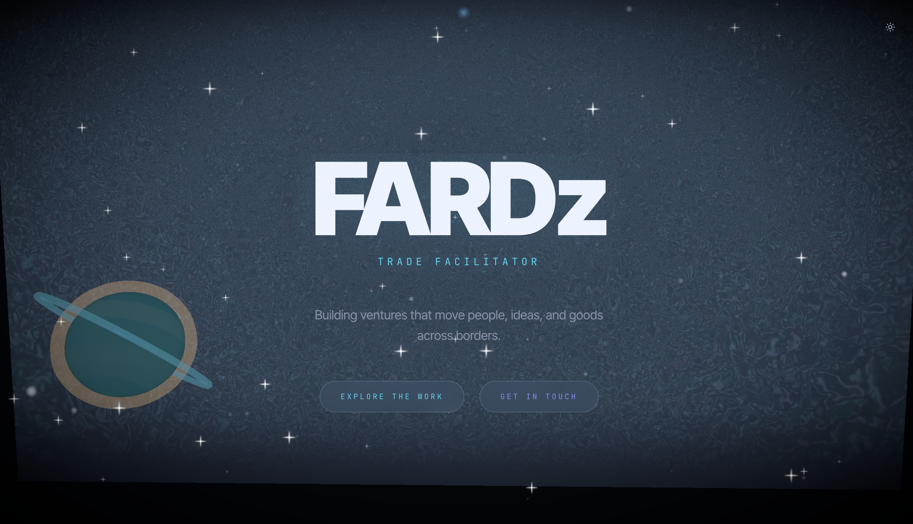
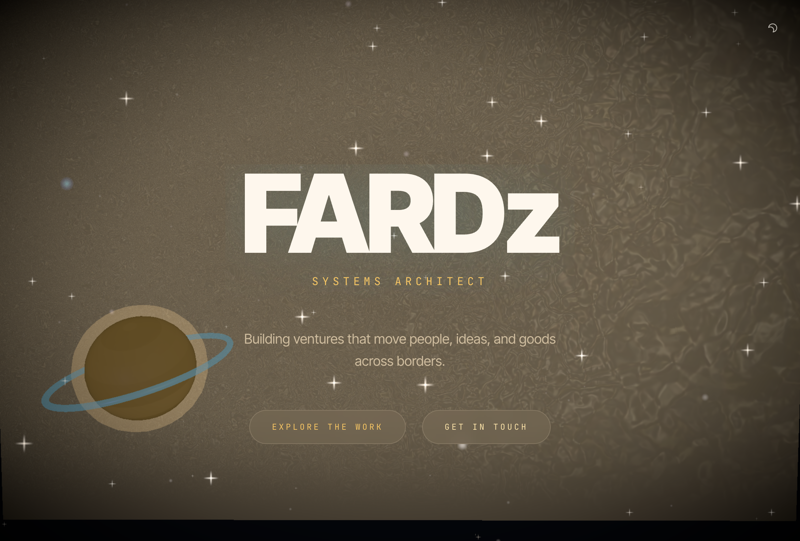
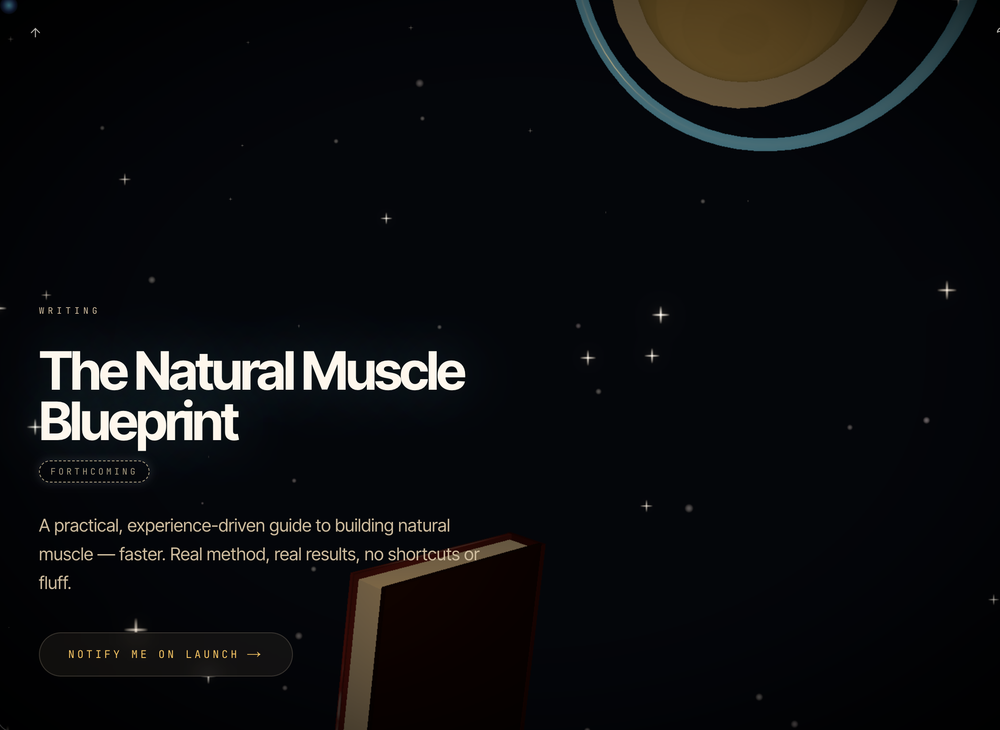
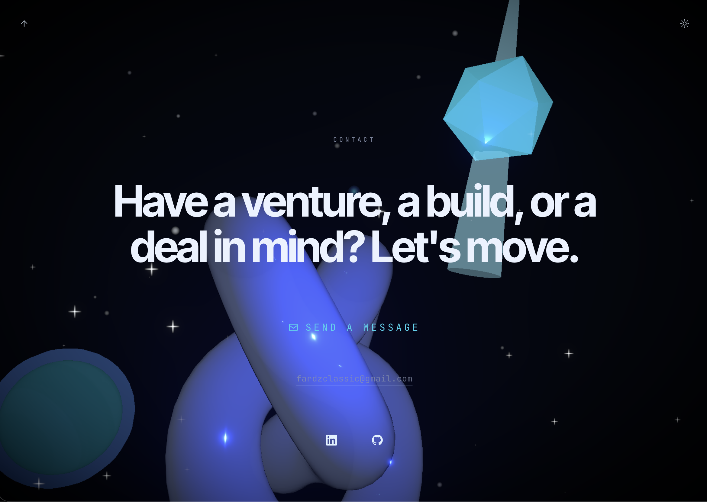

# FARDz

### Founder · Systems Architect · Trade Facilitator

A dreamlike 3D portfolio. Built ground-up with a custom WebGL camera flight,
GLSL fluid shaders, and a scroll-locked spline that carries the lens through
every scene.

**[→ Visit the live site](https://fardz.com)**

(source for this site is private by design — this repo is the showcase)

 

---

## What's inside

- **Custom WebGL world** — fluid background, camera-following point light, atmospheric particle field, drift-orbiting celestial bodies (each draggable with spring-back physics), iridescent objects with hover/throw behaviour.
- **Scroll-locked camera flight** — Catmull-Rom spline through measured DOM anchors so the camera passes the right scene exactly when the right text is centred. No JS-driven section pinning, no overlap.
- **Cinematic scroll on CTAs** — clicking *Explore* / *Contact* / *back-to-top* triggers a 3-second smoothstep arc with scroll-lock so the camera spline lands cleanly on the destination anchor with no user interruption.
- **Draggable expertise web** — fling any node and the connecting web stretches; release and it springs back to its place carrying the throw momentum.
- **Theme toggle** — chill (cold-light obsidian) ↔ warm (golden sun-flooded) crossfade across both DOM palette and WebGL shader uniforms.
- **Mobile-first 3D** — full 3D world on phone with portrait-aware framing, dragged objects via `touch-action: pan-y`, responsive DOM fallback for sections where 3D text would spill.
- **Fully accessible foundation** — semantic landmarks, ARIA, reduced-motion respected, all venture cards as real `<a>` links with descriptive labels, sr-only fallback for the 3D-only sections.

## Stack

`Next.js 16` (App Router · Turbopack · static prerender) ·
`React 19` ·
`TypeScript` ·
`Three.js + @react-three/fiber + drei` ·
`@react-three/postprocessing` (Bloom · Vignette) ·
`GSAP + ScrollTrigger` ·
`Lenis` (smooth scroll) ·
`Zustand` ·
`Tailwind CSS 4` ·
`GLSL` (fluid + curl noise shaders, procedural surface canvases) ·
Deployed on **Vercel**.

## Highlights

| Metric                       | Score |
|------------------------------|-------|
| Lighthouse · Performance     | **100** |
| Lighthouse · Accessibility   | **100** |
| Lighthouse · Best Practices  | **100** |
| Lighthouse · SEO             | **100** |

Scores from Vercel-hosted production build, mobile + desktop.

## Ventures featured

- **BeyondBorders — Travel With Us** · Co-founder & CEO · [divebeyondborders.com](https://www.divebeyondborders.com/)
- **NomadX** · Founder & CEO · *In Development*
- **Gtrust (Turkey)** · Managing Director · [gtrust.com.tr](https://www.gtrust.com.tr/)
- **SolarRed** · Foreign Trade Specialist · [solarred.com.tr](https://www.solarred.com.tr/)
- **Pfyyfa Records** · Owner & CEO · [@pfyyfa](https://www.instagram.com/pfyyfa)
- **Pasgo Farms** · Co-founder · *In Development*
- **Basfam Elegance** · Co-founder · Women's fashion
- **Basfam Enterprise** · Consignment Supplier

## Contact

- **Email** — [fardzclassic@gmail.com](mailto:fardzclassic@gmail.com)
- **LinkedIn** — [linkedin.com/in/fareedmusah](https://www.linkedin.com/in/fareedmusah)
- **GitHub** — [@MR-checks](https://github.com/MR-checks)

---

© FARDz — Across borders. Source private. Design and implementation by FARDz.

